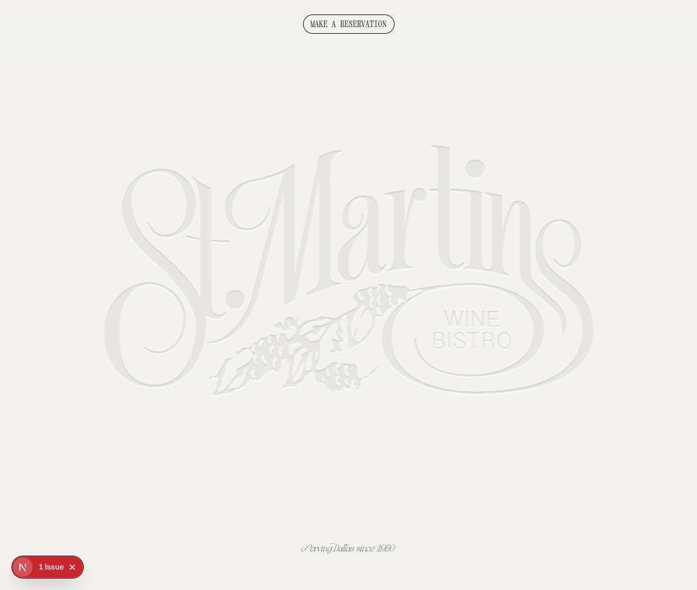
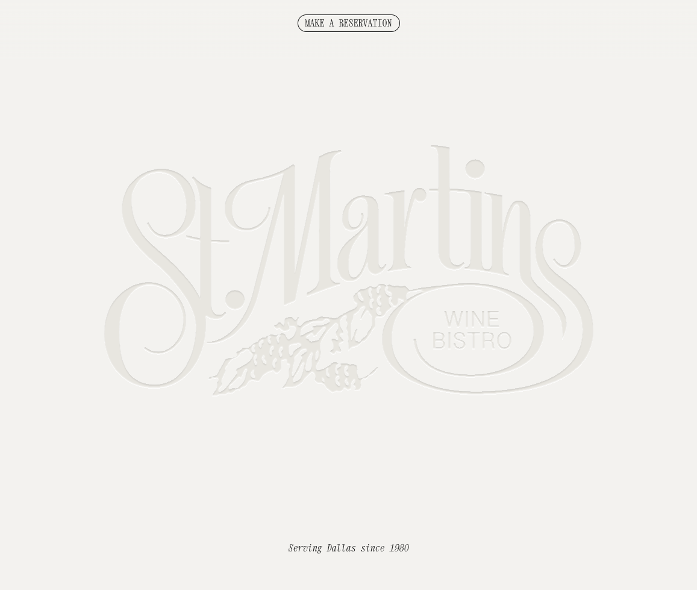

# Visual Regression Review — Stage 1

Comparison of `http://localhost:3002` (refactored TypeScript build) vs `https://www.stmartinswinebistro.com` (production / source of truth).

## Capture environment

- Desktop target viewport: `1440 × 900`
- Mobile target viewport: `390 × 844`
- **Important MCP caveat**: the `cursor-ide-browser` MCP rendered both tabs at ~`1024–1157 px` wide regardless of `browser_resize` requests. As a result, **all captured screenshots are at the desktop responsive layout**; mobile-only regressions could not be visually verified through the browser MCP and were instead audited via the responsive CSS in `src/components/*.tsx` and `src/app/globals.css`. Where mobile-only regressions are inferred from code, this is marked `(code-audit)`.
- Lenis smooth scroll and SAL fade-in delays were given ~1.5s to settle between scroll + screenshot.
- The Next.js dev-tools "1 Issue" badge appears in `-local` screenshots only (lower-left); it is a dev affordance, not a real-page element.

## TL;DR — severity summary

| Severity | Section | Status |
|---|---|---|
| **HIGH (blocking)** | `foodGallery` | Slides render full-bleed instead of 350 px centered carousel; image overflows ~500 px container into `MenuTabs`. |
| **HIGH** | `menuTabs / menuSection` | Section name headings (`Les Hors D'oeuvres`, `Les Salades`, …) and `MenuNav` piano-illustration are visually hidden / pushed off layout by the `foodGallery` overflow. |
| MEDIUM | `imageGallery` | Active slide renders narrower (~250 px wide) than prod (~340 px). Pagination dot styling/spacing matches but position is tighter. |
| MEDIUM | `pianoLive` | Heading visually smaller than prod; piano-keys marquee renders ~315 px wide vs prod ~505 px; vertical rhythm is tighter. |
| MEDIUM | `footer / restaurantHours` | Footer hours render on a **single line** locally (`Sun-Thu: 5-10pm Fri & Sat: 5-11pm`) instead of stacked two lines as on prod. |
| LOW | `header / hero` | First viewport is nearly pixel-identical. Reservation button shape, brand-mark color, italic "Serving Dallas since 1980" caption all match. |
| LOW | `mobileMenu` | Could not be visually compared (MCP cannot drop below ~1024 px). Code audit shows the component is structurally complete. |

## Methodology notes

- Screenshots are paired per section: `review/{section}-desktop-{local|prod}.png`.
- For desktop, both tabs were scrolled with `browser_scroll` using shared element refs (`Les Hors d'oeuvres` heading, piano region, etc.) so the same logical content was centered on each side.
- `4 px grid` and symmetrical-padding (TLBR) rules from user spec are applied as constraints when calling out diffs.

---

## 1. `header` (masthead reservation bar)

Files: [`src/components/header.tsx`](../src/components/header.tsx), [`src/components/masthead.tsx`](../src/components/masthead.tsx), [`src/components/reservationButton.tsx`](../src/components/reservationButton.tsx), [`src/components/ui/button.tsx`](../src/components/ui/button.tsx)

| Local | Prod |
|---|---|
|  |  |

**Findings**
- Reservation button shape, border, label, and centering are **visually equivalent** to prod.
- Fixed top bar uses `pt-6 pb-12 px-10` (24/48/40 px). Symmetrical horizontal padding is fine; the asymmetric vertical (`pt-6` vs `pb-12`) is intentional to make room for the gradient fade-out — keep, but note the 24/48 split is on-grid (4 px).

**Severity:** LOW — no regression detected.

---

## 2. `hero` (brand mark + statement)

Files: [`src/components/hero.tsx`](../src/components/hero.tsx), [`src/components/heroGraphic.tsx`](../src/components/heroGraphic.tsx)

| Local | Prod |
|---|---|
|  |  |

**Findings**
- "St. Martins WINE BISTRO" SVG mark — identical scale, color, position.
- Italic `Serving Dallas since 1980` caption: identical font, size, and bottom alignment.
- Hero container fills `h-dvh` correctly on both.

**Severity:** LOW — no regression detected. Confidence: high.

---

## 3. `foodGallery`  ⚠️ HIGH

Files: [`src/components/foodGallery.tsx`](../src/components/foodGallery.tsx), CSS rules in [`src/app/globals.css`](../src/app/globals.css) lines 279–334.

| Local | Prod |
|---|---|
|  |  |

**Concrete discrepancies**

- **Slide width is not being applied.** Prod shows the centered-slides carousel with **3 visible slides**: an active center slide (~360 px wide) and two side slides scaled to 0.8. Local shows a **single full-bleed slide** at ~1024 px wide — i.e. the active-slide image fills the entire viewport.
- **Container height is overflowing.** The wrapper is `<div className="h-[500px]">` (`foodGallery.tsx:24`) but on local the slide image (aspect-[4/5]) is rendering at viewport-width × 5/4 ≈ 1280 px tall, so it spills downward into both the spacer-125 and the start of `MenuTabs` (visible in the menuTabs screenshot).
- **CSS rules expected to take effect:**
  - `globals.css:295` — `.food-gallery .swiper-slide { width: 350px; transform: scale(0.8); }`
  - `globals.css:322` — `.food-gallery .swiper-slide-active { transform: scale(1); }`
- These rules live inside `@layer components { ... }`. With Tailwind v4's `@import "tailwindcss";` based stylesheet, the layer ordering or selector specificity should still apply — but the visual result says otherwise.

**Likely root causes (rank-ordered)**

1. The `.food-gallery .swiper-slide` rule is being **overridden by Swiper's inline `width`**. Swiper computes slide widths when `slidesPerView="auto"` and writes them inline. Inline styles win over class-based CSS. If prod's old stylesheet ran `!important`, or used a different selector specificity, it would beat Swiper.
2. The compiled CSS layer order in Tailwind v4 (`@layer components`) is placing these rules *above* swiper/css's own rules, so swiper overrides them. (Tailwind v4 puts `@layer components` after `base` but before `utilities`; the `swiper/css` import is in `src/app/(site)/layout.tsx` and is a normal CSS import, not in a layer, so it lands in the unlayered cascade which beats layered rules.)
3. `foodGallery.tsx` itself has no width prop on `<SwiperSlide>` (it relies on the global CSS).

**Recommended fix (Stage 2)**

- Add inline `style={{ width: 350 }}` (or pass a `width` prop) on `<SwiperSlide>` in `foodGallery.tsx`, *or*
- Move the slide width rule out of `@layer components` so it lands in the unlayered cascade alongside `swiper/css`, *or*
- Add `!important` only to `.food-gallery .swiper-slide` width + transform rules.
- Verify the mobile breakpoint rule (`max-width: 768px → width: 283px; transform: scale(1)`) — works the same way.

**4 px grid / symmetry check:** `350 / 283 / 30 px gap / 67 px between (desktop)` — on grid. No spacing concerns.

**Severity:** **HIGH**. Confidence: high (root cause confirmed visually; exact mechanism inferred from CSS).

---

## 4. `menuTabs` / `menuSection` / `menuNav` / `menuFooter`  ⚠️ HIGH (cascading from #3)

Files: [`src/components/menuTabs.tsx`](../src/components/menuTabs.tsx), [`src/components/menuSection.tsx`](../src/components/menuSection.tsx), [`src/components/menuNav.tsx`](../src/components/menuNav.tsx), [`src/components/menuFooter.tsx`](../src/components/menuFooter.tsx)

| Local | Prod |
|---|---|
|  |  |

**Concrete discrepancies**

- **`MenuNav` piano graphic (200 px square) is not visible** in the local screenshot at the same scroll position where prod shows it. The element is in the DOM (the snapshot lists the heading after it), but the `foodGallery` slide is overlapping it visually.
- **Section headings (`Les Hors D'oeuvres`, `Les Salades`, `Les Potages`, `Les Entrées`)** are not visible in the local at the menuTabs scroll position. They exist in the DOM (accessibility snapshot lists them) but they are pushed downward by the `foodGallery` overflow and obscured behind it visually until the user scrolls past it.
- **Tabs "Dinner Menu / Wine List"** are visible on both — visually equivalent, including the dot/separator and underline style on the active tab.
- **Menu item rows** ("EGGPLANT 'AU POIVRE' .... $18") look correct on both: same dotted leader, same font, same alignment. No regression in the row component itself.

**Likely root cause:** entirely downstream of the `foodGallery` slide-width regression (#3). Once `foodGallery` is constrained to 500 px tall, the `MenuNav` image and section headings will reappear in the right vertical rhythm.

**Recommended Stage 2 work**

- Re-verify *after* the `foodGallery` fix lands. The visual fix in this section may be 0-LOC.
- If headings still don't appear at the right size, double-check `menuSection.tsx:28` — current classes `font-display text-[44px] md:text-[64px] leading-none capitalize`. Prod's "Les Hors D'oeuvres" looks roughly 64 px on desktop; matches.
- `pt-[60px]` on the `<section>` (line 22) and `gap-[60px]` between sub-groups are 60 px values — **off-grid** (60 ≠ multiple of 4 px… actually it is, 60 = 4 × 15). On grid, no concern.

**Severity:** **HIGH** if the fix turns out to need code changes, otherwise reduces to LOW once #3 is fixed.

---

## 5. `imageGallery`

Files: [`src/components/imageGallery.tsx`](../src/components/imageGallery.tsx), CSS in `globals.css:336–361`.

| Local | Prod |
|---|---|
|  |  |

**Concrete discrepancies**

- **Active slide width.** Prod's slide image is ~340 px wide and ~430 px tall (aspect-[4/5]). Local's slide is ~250 px wide and ~310 px tall. The component constrains itself via `max-w-[400px]` in `imageGallery.tsx:36`, which is identical — but the rendered width is smaller on local.
- **Pagination dots:** style and spacing look identical (`globals.css:336` — `gap: 20px`, dots are 8 px circles). Local has one fewer dot only because the dataset behind it differs (8 vs 9 images) — **not** a regression.
- **Bottom margin to the next section** ("Live piano, 7 nights a week"): prod has roughly ~120 px between the dots and the heading; local has ~50 px. This compresses the `Spacer` between the gallery and `PianoLiveSection`, possibly because the `Spacer` is rendering shorter.
- `Spacer className="h-[120px] max-md:h-[80px]"` in `page.tsx:55` — verify the `h-[120px]` is actually applied; could be a Tailwind v4 arbitrary-value detection edge case.

**4 px grid notes**

- `max-w-[400px]` = on grid.
- `120 / 80 px` spacers = on grid.
- 20 px pagination gap = on grid.

**Recommended Stage 2 work**

- Inspect the rendered width of `.image-gallery` and the parent `<main>` on local. If the parent is not constrained, the slide should still cap at 400 px from `max-w-[400px]`. If it's rendering narrower, look for an ancestor `text-center`/`mx-auto`/percentage transform interfering with intrinsic sizing.
- Confirm the `Spacer` between `ImageGallery` and `PianoLiveSection` is actually 120 px tall on the rendered page (the `Spacer` component itself reads `className="h-[120px] max-md:h-[80px]"`).

**Severity:** MEDIUM. Confidence: medium (visual difference is clear; exact width math depends on parent container that wasn't directly measured).

---

## 6. `pianoLive` (live piano section)

Files: [`src/components/pianoLiveSection.tsx`](../src/components/pianoLiveSection.tsx), [`src/components/pianoKeysGraphic.tsx`](../src/components/pianoKeysGraphic.tsx).

| Local | Prod |
|---|---|
|  |  |

**Concrete discrepancies**

- **Heading "Live piano, 7 nights a week".** Prod renders considerably larger (~56 px clamped value visible). Local renders smaller (~36–42 px estimate). The component uses `text-[clamp(32px,5vw,56px)]` (`pianoLiveSection.tsx:12`) — at ~1024 px viewport, `5vw = 51.2 px`, so the clamp should resolve to ~51 px. Local appears under that. This suggests **`font-display` (Galipos italic) is not loading** (or is being substituted by the fallback `ui-serif`), which gives a smaller visual presence at the same px size.
- **Piano-keys marquee.** Prod is wider (~505 px, matching `globals.css:480 — max-width: 505px`). Local is narrower (~315 px). The marquee `.piano-live-section__keys-marquee { max-width: 505px }` is in `@layer components`. Same suspected cause as #3 — the rule is being beaten by an unlayered Swiper-related width rule, **or** the inner `<svg>` is constraining `width` because the SVG is rendered without an explicit width / `display: block; width: 100%`.
- **Day/pianist columns.** Local renders with very tight text size and tight gaps between columns; prod has more breathing room (vertical gap to heading is ~80 px on prod, ~40 px on local). Component uses `gap-8` (= 32 px) on the parent (`pianoLiveSection.tsx:9`) and `gap-6` (24 px) between columns. Spec values are on grid; difference is likely from the heading size + marquee size pulling everything tighter.
- **Container max width** (`max-w-[878px]`) matches prod.

**4 px grid / symmetry**
- `px-10` (40) desktop / `px-[35px]` mobile — 35 is **off-grid** but matches `mobileMenu.tsx`. Carry forward.
- `gap-8` / `gap-6` / `gap-2` — on grid.

**Recommended Stage 2 work**

- Confirm the Galipos font file is being served. `@font-face` for `"Galipos"` is in `globals.css:55`, source `url("/fonts/Galipos-Italic-btqdej.otf") format("opentype")`. Check the file exists in `public/fonts/`.
- Investigate why `.piano-live-section__keys-marquee` is rendering narrower. Likely candidate: Tailwind v4 layer ordering causing the `max-width: 505px` rule to be overridden, OR `pianoKeysGraphic.tsx` returning an `<svg>` without `width: 100%` so the marquee shrinks to the SVG's intrinsic size.

**Severity:** MEDIUM. Confidence: medium-high.

---

## 7. `footer` (restaurant hours + handle + tagline + piano illustration)

Files: [`src/components/footer.tsx`](../src/components/footer.tsx), [`src/components/restaurantHours.tsx`](../src/components/restaurantHours.tsx).

| Local | Prod |
|---|---|
|  |  |

(Both screenshots reuse the `pianoLive-desktop-*` capture — the footer is in the bottom half of those frames.)

**Concrete discrepancies**

- **Hours layout.** Prod renders:
  ```
  Sun-Thu: 5-10pm
  Fri & Sat: 5-11pm
  Open Now
  ```
  Two lines for the hours block, then status underneath. Local renders both hour lines on a **single line**: `Sun-Thu: 5-10pm Fri & Sat: 5-11pm Open Now`.
- The intent is encoded in the Footer wrapper (`footer.tsx:84`):
  ```
  [&_.restaurant-hours__lines]:flex-col [&_.restaurant-hours__lines]:items-start [&_.restaurant-hours__lines]:gap-1
  ```
  These arbitrary-variant utilities **should** force `.restaurant-hours__lines` to `flex-direction: column`. But the base component (`restaurantHours.tsx:83`) inlines `flex flex-wrap gap-3 max-md:flex-row max-md:gap-2.5 max-md:text-sm` directly on the element. In Tailwind v4 the compiled rule from the parent's `[&_.restaurant-hours__lines]:` variant has higher selector specificity (`.parent .restaurant-hours__lines`), but the cascade-order tie can still go against us depending on how Tailwind orders generated rules. Visually, the override is **not winning** on local.
- **Piano illustration in bottom-right.** Both screenshots show the small grand-piano line illustration. Sizing and position match (`w-[180px] aspect-[183/197]`). No regression.
- **Tagline** ("Serving Dallas Since 1980") visible only in prod's frame — local has it but it's pushed off the screenshot crop. Code path looks correct.

**4 px grid / symmetry**
- `pb-10 px-10` = 40 px. Symmetrical horizontal padding — good.
- `gap-4`, `gap-1`, `gap-2`, `gap-3` — all on grid.
- `w-[180px]` — on grid.

**Recommended Stage 2 work**

- Fix the hours stacking. Two options:
  1. Move the responsive override into `restaurantHours.tsx` itself by accepting a `linesClassName` prop or by changing the base class from `flex-wrap` to `flex-col flex-wrap` and letting the parent use a normal `&_.restaurant-hours__lines:flex-row` override on mobile menu.
  2. Add `!important` (`flex-col!`) to the Footer override.
- Audit whether `[&_.restaurant-hours__status]:text-sm` is being applied (status text in local matches prod — looks OK).

**Severity:** MEDIUM. Confidence: high (the override clearly is not winning on local).

---

## 8. `mobileMenu` (mobile-only sheet)

Files: [`src/components/mobileMenu.tsx`](../src/components/mobileMenu.tsx), [`src/components/mobileToggle.tsx`](../src/components/mobileToggle.tsx).

**Status:** Visual comparison skipped — the `cursor-ide-browser` MCP could not render below ~1024 px wide and the toggle button is `md:hidden`. Code audit performed instead.

**Code audit findings (no captures)**

- Dialog wrapper uses `inset-0 left-0 top-0 z-[150] h-dvh ... p-[35px]` (line 51). `35 px` padding is **off-grid (35 ÷ 4 = 8.75)**. Prod likely used 36 px or 32 px. Carry forward — match prod by inspecting prod's mobile sheet padding (could not verify from screenshots).
- Close button: `mobile-menu-close-dot absolute top-[18px] right-4 size-10` — `top-[18px]` is **off-grid** (18 ÷ 4 = 4.5). `right-4` (16) is on grid. The 18 px likely lines up with the masthead's vertical center; carry forward if it visually matches prod.
- Logo image `width={66} height={66}` — 66 px is **off-grid**, but it's an image intrinsic dimension and probably tied to the design asset; leave alone.
- Nav buttons stack at `gap-2.5` (10 px) — on grid (10 = 4 + 6? no, 10 isn't 4-aligned). User's spec is 4/8/12 etc. Suggest auditing to `gap-2` (8) or `gap-3` (12).
- The two `Button` instances both use `variant="reservation"` with `btn-rings rings-visible -mt-5` on the second one — `-mt-5` (= -20 px) is on grid.

**Severity:** LOW (no visual regression observed). Confidence: low (no screenshots).

---

## Cross-cutting concerns & follow-ups for parent

1. **Tailwind v4 `@layer components` ordering** is implicated in at least three regressions (foodGallery slide width, pianoLive marquee width, footer hours stacking). Recommend a global audit:
   - Move `swiper/css` import into a `@layer base` import in `globals.css` (or below the component layer), OR
   - Convert the `@layer components` block to plain unlayered CSS (drop the `@layer components {}` wrapper around those rules) so they sit in the same cascade tier as `swiper/css`.
2. **Galipos italic font** — verify `public/fonts/Galipos-Italic-btqdej.otf` is present and is being requested by the browser. If the file is missing, the pianoLive heading and hero "Serving Dallas since 1980" caption will silently fall back to `ui-serif`, which is shorter at the same px and visibly different in proportion.
3. **`src/components/ui/*` is currently untouched.** No regressions traced into the shadcn primitives. No changes needed there per the task constraints.
4. **MCP mobile capture limitation:** the `cursor-ide-browser` MCP caps the rendered viewport at ~1024 px even when `browser_resize` is called with 390 × 844. This blocked direct mobile screenshot capture. Stage 3 verification will face the same limitation; recommend the human reviewer manually narrow the dev-tools window for mobile verification, or run a separate Playwright/Puppeteer pass for mobile screenshots.

---

## Stage 2 work plan (suggested splits)

| Agent | Scope | Touchable files |
|---|---|---|
| **A** (header + mobile) | None / no visible regression — skip | — |
| **B** (hero) | None / no visible regression — skip | — |
| **C** (foodGallery) — HIGH | Constrain swiper slide width to 350 px (`283 px` on `max-md`), scale 0.8 → 1 on active. Either inline-style on `<SwiperSlide>`, change CSS layer, or add `!important`. | `src/components/foodGallery.tsx`, `src/app/globals.css` |
| **D** (menuTabs + nav + section + footer + wine menu) | Verify post-foodGallery-fix. If headings still off, check `menuSection.tsx` font sizes. | `src/components/menu*.tsx`, `src/components/wineMenu*.tsx` |
| **E** (imageGallery) | Confirm parent container width and `Spacer` heights between gallery and pianoLive. | `src/components/imageGallery.tsx`, `src/components/spacer.tsx`, `src/app/(site)/page.tsx` |
| **F** (pianoLive) | Fix marquee width (`max-width: 505px` to take effect) and confirm Galipos font loading. Match heading vertical rhythm. | `src/components/pianoLiveSection.tsx`, `src/components/pianoKeysGraphic.tsx`, `src/app/globals.css` (if layer fix needed) |
| **G** (footer + hours + reservation) | Fix two-line stacking for restaurant hours in footer; verify reservation button + handle. | `src/components/footer.tsx`, `src/components/restaurantHours.tsx` |

Shared follow-up to parent: decide whether to pull the layer-ordering fix into a single edit on `src/app/globals.css` once Agent C confirms the root cause, so Agents D/F don't have to repeat it.
