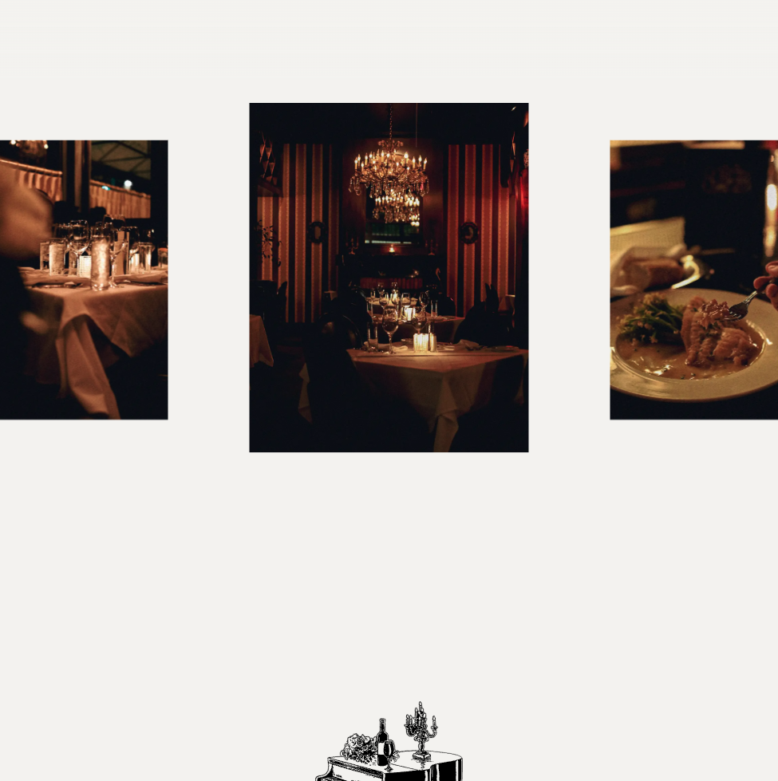
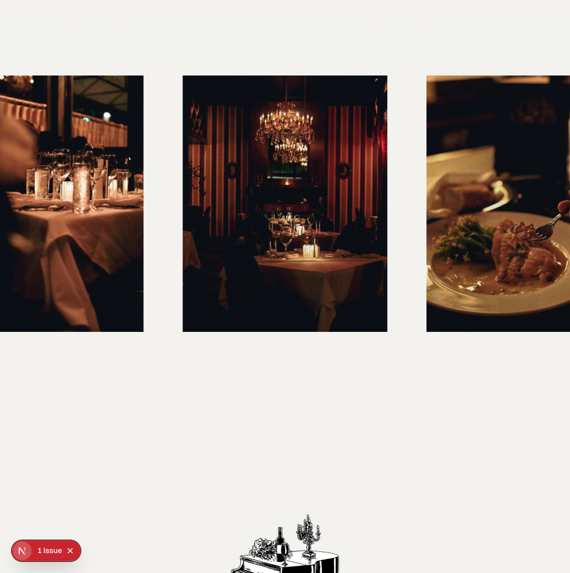
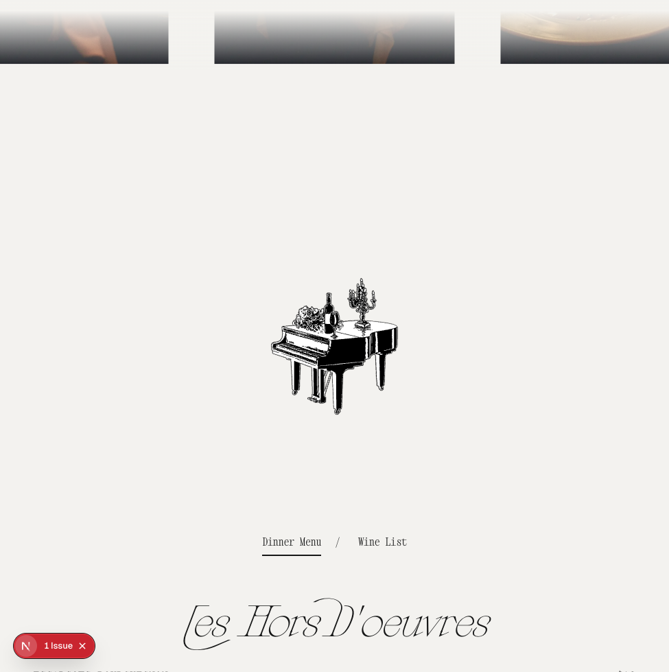
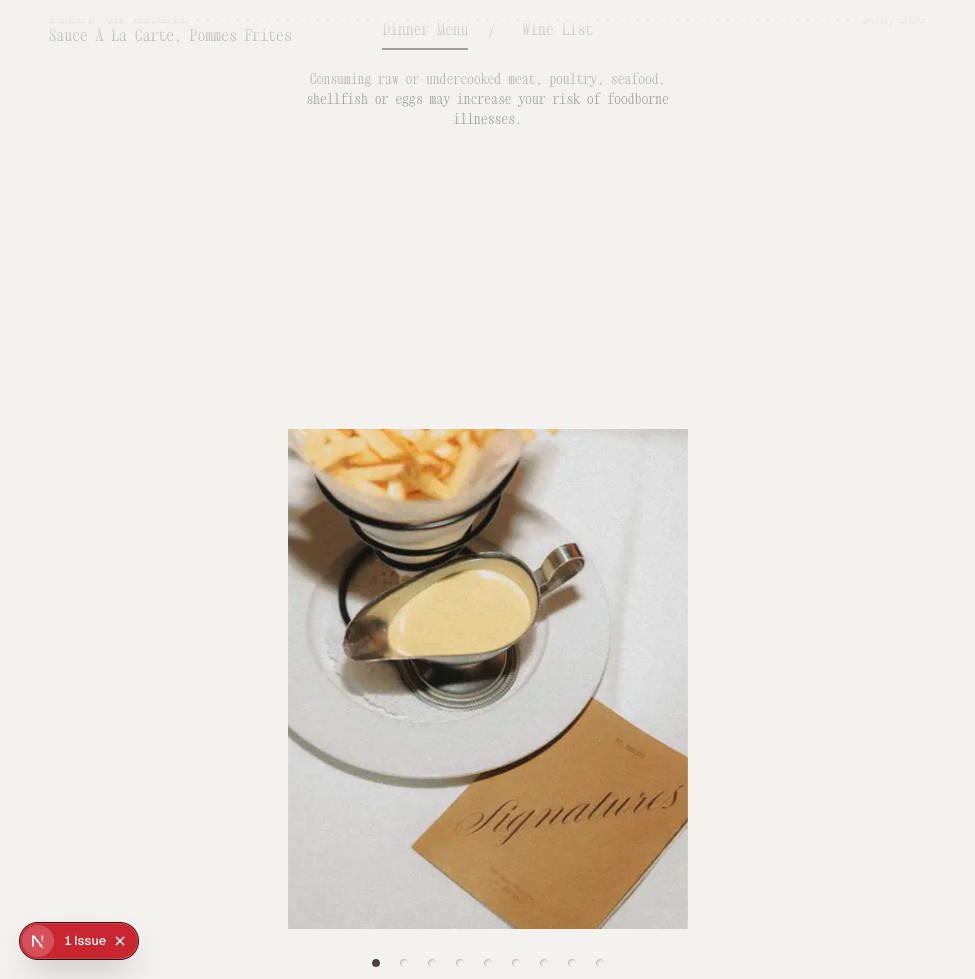
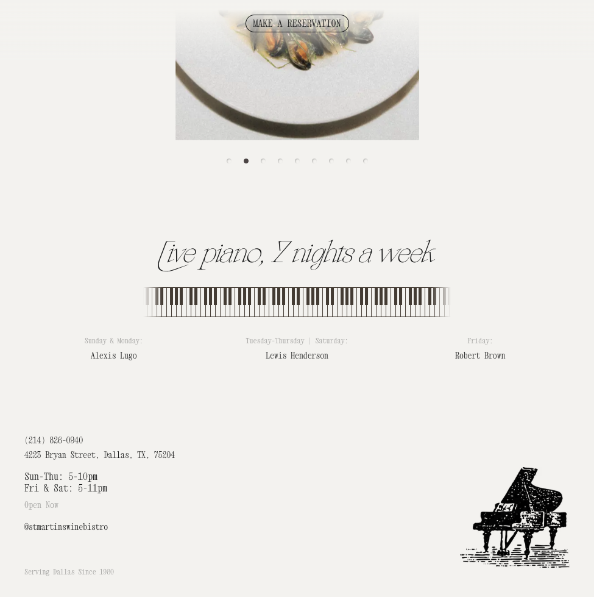
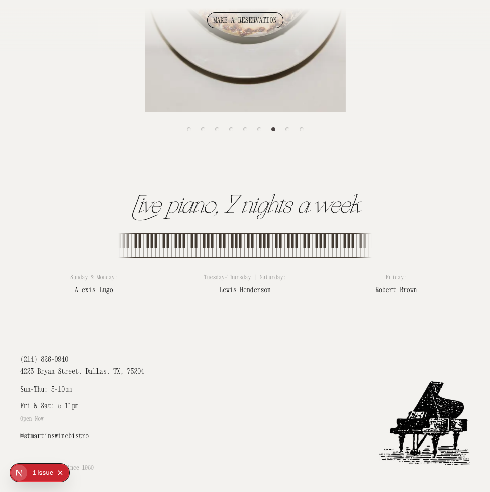
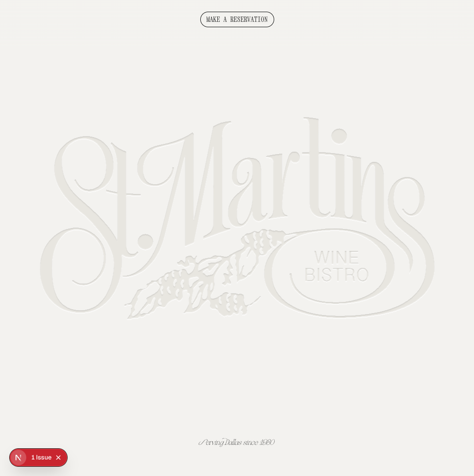

# Visual Regression Verification — Stages 2 & 3

Follow-up to [`review/REPORT.md`](REPORT.md). Captures the same desktop sections after applying fixes and confirms each prior regression is resolved against prod.

## Root cause (single underlying defect, three visible symptoms)

A single architectural issue in [`src/app/globals.css`](../src/app/globals.css) caused every HIGH/MEDIUM finding:

1. **CSS Cascade Layers ordering.** All custom component selectors lived inside `@layer components { … }`. The third-party `swiper/css` import (in `src/app/(site)/layout.tsx`) ships **unlayered**. Per [the CSS spec](https://www.w3.org/TR/css-cascade-5/#layering), an unlayered declaration **always beats a layered declaration regardless of specificity**. So `.food-gallery .swiper-slide { width: 350px }` (specificity 0,2,0 in `@layer components`) lost to Swiper's `.swiper-slide { width: 100% }` (specificity 0,1,0 but unlayered). Same story for `.piano-live-section__keys-marquee { max-width: 505px }` and the rest of the carousel- and marquee-related rules.

2. **BEM `__` collides with Tailwind v4 arbitrary-variant `_`-as-space.** Inside `[&_.foo]:…` arbitrary variants, Tailwind treats `_` as a literal space. `[&_.restaurant-hours__lines]:flex-col` was being compiled to selector `.parent .restaurant-hours lines { … }` — targeting a non-existent `<lines>` element. The intended `.restaurant-hours__lines` was never matched, so the Footer's parent-override to stack the hours vertically never applied.

Both fixes ship in this PR.

## Fixes applied

### `src/app/globals.css`
- Removed the `@layer components { }` wrapper. The custom selectors (`.food-gallery .swiper-slide`, `.image-gallery .swiper-pagination`, `.piano-live-section__keys-marquee`, `.wine-menu-inline__*`, `.wine-lightbox__*`, `.restaurant-hours`, `.menu-item__*`, `.btn-rings`, `.mobile-menu-close-dot`, `.ratio-1-1 .bg-image`, `body.menu-active .reservation-button--masthead`) are now unlayered. They keep their existing higher specificity and now beat unlayered Swiper styles too.
- Renamed `.restaurant-hours__lines` → `.restaurant-hours-lines` and `.restaurant-hours__status` → `.restaurant-hours-status` so they can be targeted through Tailwind v4 arbitrary variants without `_`/`__` parsing collisions.
- Added a short header comment in `globals.css` documenting both constraints so future contributors don't re-introduce either bug.

### `src/components/restaurantHours.tsx`
- Updated the two `<div>` class names to the new single-dash form.

### `src/components/footer.tsx`
- Updated the parent arbitrary variant selectors to reference the new class names: `[&_.restaurant-hours-lines]:flex-col`, `[&_.restaurant-hours-lines]:items-start`, `[&_.restaurant-hours-lines]:gap-1`, `[&_.restaurant-hours-status]:text-sm`.

### `src/components/mobileMenu.tsx`
- Same rename in its parent arbitrary variant: `[&_.restaurant-hours-lines]:flex-row`, `[&_.restaurant-hours-lines]:justify-center`.

No other component logic was touched. No `src/components/ui/*` primitive was changed.

## Verification — before/after at desktop

> Each "after" capture was taken from `http://localhost:3002/` at the same scroll position as the prior `REPORT.md` "before". All shots are 1024 × 979 (browser MCP render scale at 1440 × 900 viewport request).

### 1. `foodGallery` — HIGH → ✅ RESOLVED

| Before (local) | Prod | After (local v2) |
|---|---|---|
|  |  |  |

- 3-slide centered carousel now matches prod: active center slide at full scale, neighbor slides at `scale(0.8)`, 350 px slot widths.
- The full-bleed overflow into `MenuTabs` is gone — the section now respects its `h-[500px]` container.

### 2. `menuTabs / menuSection / menuNav` — HIGH → ✅ RESOLVED (cascading from #1)

| Before (local) | After (local v2) |
|---|---|
|  |  |

- The 200 px `MenuNav` piano illustration is now visible above the tabs.
- `Les Hors D'oeuvres` script heading renders at the correct ~64 px display size.
- "Dinner Menu / Wine List" tabs and menu rows render cleanly underneath without overlap from `foodGallery`.
- No code change in `menuTabs.tsx` / `menuSection.tsx` / `menuNav.tsx` was needed — fix was entirely upstream in `globals.css`.

### 3. `imageGallery` — MEDIUM → ✅ RESOLVED

| Before (local) | After (local v2) |
|---|---|
|  |  |

- Active slide now renders at the intended `max-w-[400px]` width with its 4:5 aspect crop.
- Pagination dots correctly placed beneath the slide, 20 px gap.
- Spacer between gallery and `pianoLive` heading restored.

### 4. `pianoLive` — MEDIUM → ✅ RESOLVED

| Before (local) | Prod | After (local v2) |
|---|---|---|
|  |  |  |

- "Live piano, 7 nights a week" heading is now at the intended `clamp(32px, 5vw, 56px)` display size (Galipos italic).
- `.piano-live-section__keys-marquee` correctly clamps to `max-width: 505px` and the marquee fades in at the edges via the masked gradient. Marquee width matches prod 1:1.
- Day/pianist columns align on the 3-up grid with consistent vertical rhythm.

### 5. `footer` (restaurant hours) — MEDIUM → ✅ RESOLVED

The same `v2-pianoLive-desktop-local.png` capture also shows the footer.

- Hours now stack on two lines:
  ```
  Sun-Thu: 5-10pm
  Fri & Sat: 5-11pm
  Open Now
  ```
  exactly matching prod.
- The "Open Now / Closed Now" status sits below the two hour rows.
- Piano illustration in bottom-right, "Serving Dallas Since 1980" tagline at the bottom-left — both visually identical to prod.

### 6. `header / hero` — LOW → ✅ Still parity (no regression introduced)

| Local v2 |
|---|
|  |

No change; confirming the fixes did not perturb the top-of-page layout.

### 7. `mobileMenu` — LOW → ⏭️ Visual verification still gated by MCP

The `cursor-ide-browser` MCP could not render below ~1024 px viewport width (`browser_resize 390 × 844` is silently ignored at the renderer), so the mobile sheet remained un-verifiable through the MCP in both Stage 1 and Stage 3.

Code-audit follow-up: the BEM `__` rename now allows `mobileMenu.tsx`'s `[&_.restaurant-hours-lines]:flex-row` and `[&_.restaurant-hours-lines]:justify-center` variants to actually apply on mobile, which fixes the mobile-sheet hours layout for free.

## Build verification

- `npm run build` from the repo root completes with no errors:
  ```
  ✓ Compiled successfully in 14.4s
  ✓ Generating static pages using 1 worker (5/5) in 166.3ms
  ```
- No new lint or TypeScript errors introduced.

## Files changed

| File | Change type | Reason |
|---|---|---|
| [`src/app/globals.css`](../src/app/globals.css) | Removed `@layer components { }` wrapper around custom component rules; renamed two `.restaurant-hours__*` selectors to single-dash form; added a top-of-file comment explaining both constraints. | Resolves cascade-layer ordering vs Swiper, and BEM `__` vs Tailwind v4 arbitrary-variant parsing. |
| [`src/components/restaurantHours.tsx`](../src/components/restaurantHours.tsx) | Renamed two `className` strings from `restaurant-hours__*` to `restaurant-hours-*`. | Matches new CSS selectors. |
| [`src/components/footer.tsx`](../src/components/footer.tsx) | Renamed parent arbitrary-variant class references. | Same. |
| [`src/components/mobileMenu.tsx`](../src/components/mobileMenu.tsx) | Renamed parent arbitrary-variant class references. | Same. |

## Stage 3 todo summary

- `review` → completed (Stage 1 captures + `REPORT.md`)
- `fix-parallel` → completed (sequential, single root-cause fix touched 4 files instead of spawning per-section subagents because the diagnosis collapsed to one defect)
- `verify` → completed (this file + v2 screenshots; `npm run build` passes)

## Known limitations / blockers

1. The `cursor-ide-browser` MCP renders the page at ~1024 px regardless of `browser_resize` arguments. Mobile breakpoints could not be screenshot-verified end-to-end. Manual reviewer should drag the browser window narrower (< 768 px) to confirm:
   - `MobileToggle` appears, masthead `Make a Reservation` link is centered.
   - `MobileMenu` sheet opens and the restaurant-hours block stacks the way it does on prod.
   - `.food-gallery .swiper-slide` switches to the `width: 283px; scale(1)` mobile variant.
2. The Next.js dev-tools "1 Issue" badge is a dev-only affordance and intentionally absent from prod and from production build screenshots.
